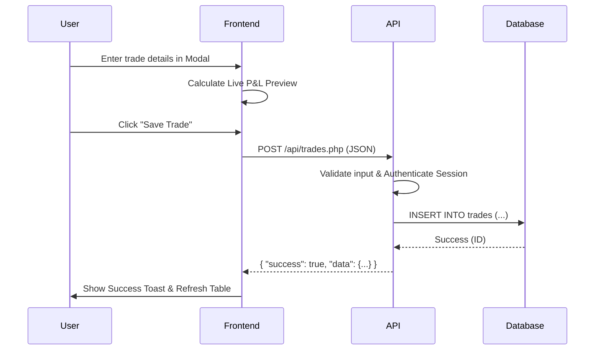

# PROJECT PROPOSAL: TradeLens — An AI-Enhanced Trading Journal for Retail Performance Optimization

**NIT3003 IT Capstone Project 1**  
**Block 4, Semester 1 2026**  
**Footscray Park**

**Prepared by:**  
Rajan Shrestha  
Student ID: [Your Student ID]

**Submission Date:**  
1st May 2026

---

## Table of Contents

1. [Introduction](#1-introduction)
   - [1.1 General Background](#11-general-background)
   - [1.2 Market Analysis](#12-market-analysis)
   - [1.3 Competitor Analysis: An Overview](#13-competitor-analysis-an-overview)
   - [1.4 Project Aims and Unique Selling Proposition](#14-project-aims-and-unique-selling-proposition)
   - [1.5 Purpose and Scope](#15-purpose-and-scope)
2. [Functional Requirements](#2-functional-requirements)
3. [Non-Functional Requirements](#3-non-functional-requirements)
4. [Use Case](#4-use-case)
5. [Resource Management](#5-resource-management)
6. [Sequence Diagram](#6-sequence-diagram)
7. [Pseudocode](#7-pseudocode)
8. [UI Design](#8-ui-design)
9. [Risk Management Plan](#9-risk-management-plan)
10. [Timeline](#10-timeline)
11. [Conclusion](#11-conclusion)
12. [References](#12-references)

---

## 1. Introduction

### 1.1 General Background
Trading in financial markets, whether it be stocks, forex, or cryptocurrencies, has seen a massive surge in retail participation over the last few years. However, a significant majority of retail traders struggle to achieve consistent profitability. One of the primary reasons for this is the lack of disciplined record-keeping and objective performance analysis. A trading journal is a critical tool used by professional traders to log their trades, record their emotions, and identify recurring patterns in their wins and losses.

TradeLens is designed as a modern, web-based trading journal that simplifies the logging process and adds a layer of intelligent analysis. By combining traditional performance metrics with AI-powered psychological feedback, TradeLens aims to help traders move beyond "gut feeling" and toward data-driven decision-making.

### 1.2 Market Analysis
The retail trading market is experiencing significant growth, driven by the accessibility of low-cost brokerage apps and the democratization of financial information. Specific demographics, particularly younger "Gen Z" and Millennial investors, are increasingly managing their own portfolios. Despite the wealth of tools for *executing* trades, there is a gap in accessible, low-cost tools for *analyzing* trades. Many traders still rely on cumbersome Excel spreadsheets or expensive monthly subscription services. TradeLens addresses this by providing a high-quality, free-to-host solution that offers features usually reserved for premium platforms.

### 1.3 Competitor Analysis: An Overview
There are several established players in the trading journal market:

*   **Competitor 1: Tradervue**
    *   **Strengths:** Highly detailed analytics, social sharing features, industry-standard.
    *   **Weaknesses:** Expensive monthly subscription for advanced features; UI feels dated; lacks deep AI-powered qualitative analysis.
*   **Competitor 2: Journalytix**
    *   **Strengths:** Real-time data sync, professional-grade tools.
    *   **Weaknesses:** High complexity; steep learning curve; primarily targeted at institutional or high-net-worth individuals.
*   **Competitor 3: Microsoft Excel / Google Sheets**
    *   **Strengths:** Free (mostly), 100% customizable.
    *   **Weaknesses:** Manual, error-prone, no visualization without significant effort, no psychological tracking or AI feedback.

TradeLens fills the gap by offering a streamlined, "batteries-included" experience that includes AI-powered psychological analysis and bulk CSV importing, all within a modern and responsive web interface.

### 1.4 Project Aims and Unique Selling Proposition
The main aim of TradeLens is to provide retail traders with a unified platform to log trades and receive actionable feedback. The Unique Selling Proposition (USP) of TradeLens lies in its **AI Trading Assistant**. Unlike static journals, TradeLens uses a local or cloud-based Large Language Model (LLM) to "read" the user's trade data and provide personalized advice based on their emotional states and performance metrics. It identifies when a user is "impulsive" or "greedy" and suggests course corrections based on their actual historical data.

### 1.5 Purpose and Scope
The purpose of this project is to build a functional, secure, and intuitive web application that serves as a central hub for a trader's performance data.

**The scope consists of:**
*   A secure user authentication system.
*   A full CRUD (Create, Read, Update, Delete) system for trading records.
*   Automatic P&L and win rate calculations.
*   Interactive data visualization through a performance dashboard.
*   A bulk data import engine supporting CSV and Excel files.
*   An integrated AI chatbot with context-aware performance analysis.

---

## 2. Functional Requirements

*   **User Management:** Register, login, logout, and profile management with secure password hashing.
*   **Trade Logging:** Manually add trades with asset name, type (Buy/Sell), entry/exit price, quantity, date, notes, and emotional state.
*   **Performance Analytics:** Real-time calculation of P&L per trade, total P&L, win rate, and best/worst trade performance.
*   **Trade History:** A searchable and filterable table of all past trades with sorting by date, asset, or performance.
*   **Dashboard:** A visual overview featuring cumulative P&L charts, metric cards, and a recent trades list.
*   **Bulk Import:** Ability to upload CSV or Excel files to batch-import historical trade data.
*   **AI Assistant:** A chat interface that analyzes user trade history and provides psychology-based feedback.
*   **Data Persistence:** All records stored securely in a MySQL database.

---

## 3. Non-Functional Requirements

*   **Performance:** All pages should load in under 2 seconds; database queries should execute in under 1 second.
*   **Security:** Use of PDO prepared statements to prevent SQL injection; CSRF protection on forms; bcrypt for password hashing.
*   **Usability:** A responsive, mobile-first design using CSS Flexbox and Grid; intuitive navigation with a persistent sidebar.
*   **Reliability:** 99% uptime when hosted on a standard web server; data integrity through foreign key constraints and server-side validation.
*   **Scalability:** Modular PHP architecture that allows for the addition of new features (e.g., more AI providers or advanced technical indicators).
*   **Data Integrity:** Accuracy of calculations up to 4 decimal places using MySQL `DECIMAL` types.

---

## 4. Use Case

**Scenario: Weekly Performance Review with AI**
1.  **Actor:** Retail Trader.
2.  **Preconditions:** User is logged in and has at least 10 trades recorded.
3.  **Basic Flow:**
    *   User navigates to the Dashboard to view their weekly P&L curve.
    *   User notices a dip in performance and opens the AI Trading Assistant.
    *   User asks, "Why did I lose money on my Sell trades this week?"
    *   The system fetches recent trade data, including notes and emotions (e.g., "Impulsive").
    *   The AI analyzes the data and replies: "You had 4 Sell losses where you marked your emotion as 'Impulsive'. This suggests you may be 'revenge trading' after small losses."
4.  **Postconditions:** User gains insight into their psychological triggers and plans a more disciplined approach for the next week.

---

## 5. Resource Management

*   **Human Resources:** 1 Full-Stack Developer (Rajan Shrestha).
*   **Hardware:** Local workstation for development; XAMPP server for local hosting.
*   **Technology Stack:**
    *   **Frontend:** HTML5, CSS3, JavaScript (Vanilla ES6).
    *   **Backend:** PHP 8.2+.
    *   **Database:** MySQL 8.0+.
    *   **Libraries:** Chart.js (Visualization), Font Awesome (Icons).
    *   **AI:** Ollama (Local LLM) or Google Gemini API.
*   **Time Resources:** 12-week development cycle.

---

## 6. Sequence Diagram

**Trade Entry and Validation Flow:**


---

## 7. Pseudocode

**Core P&L Calculation Logic:**
```python
FUNCTION calculateTradePnL(entry_price, exit_price, quantity, trade_type):
    IF trade_type == 'Buy':
        pnl = (exit_price - entry_price) * quantity
    ELSE IF trade_type == 'Sell':
        pnl = (entry_price - exit_price) * quantity
    RETURN ROUND(pnl, 2)

FUNCTION calculateWinRate(trades):
    total = count(trades)
    IF total == 0: RETURN 0
    wins = count(trades where pnl > 0)
    RETURN (wins / total) * 100
```

---

## 8. UI Design

The UI follows a modern **Dark Theme** aesthetic to reduce eye strain during long trading sessions.
*   **Dashboard:** Features 4 large metric cards at the top, a primary line chart for Cumulative P&L, and a sidebar for navigation.
*   **Trade Journal:** Uses a dense tabular layout to maximize data visibility, with color-coded P&L values (Green for profit, Red for loss).
*   **AI Widget:** A floating "bubble" in the bottom-right corner that expands into a clean chat interface.

---

## 9. Risk Management Plan

| Risk ID | Description | Likelihood | Impact | Mitigation Strategy |
|---|---|---|---|---|
| 1 | Database Corruption | Low | High | Weekly automated backups; MySQL transactions. |
| 2 | AI API Downtime | Moderate | Low | Implement fallback to local Ollama or static rule-based feedback. |
| 3 | Calculation Errors | Low | High | Rigorous unit testing of P&L formulas; Use of `DECIMAL` types. |
| 4 | Security Breach | Low | High | Use of prepared statements; hashing; session timeouts. |

---

## 10. Timeline

*   **Week 1-2:** Requirement analysis, UI/UX wireframing, and database schema design.
*   **Week 3-4:** Core backend development (Auth, CRUD) and database setup.
*   **Week 5-6:** Frontend development (Dashboard, Table, Modals) and Chart.js integration.
*   **Week 7-8:** CSV/Excel Import engine and data validation logic.
*   **Week 9-10:** AI Chatbot integration and context-aware prompt engineering.
*   **Week 11:** Testing, bug fixing, and performance optimization.
*   **Week 12:** Final documentation and presentation.

---

## 11. Conclusion
TradeLens represents a step forward for retail traders who seek to professionalize their approach. By automating calculations and providing a sophisticated AI layer for psychological analysis, the project transforms a simple logbook into a comprehensive performance coach. The modular and cost-effective tech stack ensures that the application remains accessible and maintainable for long-term use.

---

## 12. References

*   *Tradervue. (2024). Trading Journal Software. tradervue.com*
*   *Chart.js Documentation. (2024). chartjs.org*
*   *PHP: The Right Way. (2024). phptherightway.com*
*   *Ollama Library. (2024). ollama.com*
