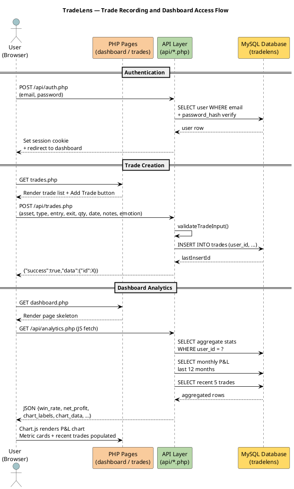

# PROJECT PROPOSAL: TradeLens — Personal Trading Journal & Analytics Platform

**NIT3003 IT Capstone Project 1**
**Prepared by:** Rajan Shrestha
**Submission Date:** 2nd May 2026

---

## Table of Contents

1. [Introduction](#introduction)
   - General Background
   - Market Analysis
   - Competitor Analysis: An Overview
   - Project Aims and Unique Selling Proposition
   - Purpose and Scope
2. [Functional Requirements](#functional-requirements)
   - User Authentication and Account Management
   - Trade Entry and CRUD Operations
   - Trade Filtering, Search, and Sorting
   - Analytics and Performance Metrics
   - Data Visualisation and Reporting
3. [Non-functional Requirements](#non-functional-requirements)
   - System Reliability
   - Security
   - Usability
   - API Design
   - Scalability
4. [Use Case](#use-case)
   - Recording a New Trade
   - Viewing Analytics Dashboard
   - Filtering and Reviewing Trade History
5. [Resource Management](#resource-management)
6. [Sequence Diagram](#sequence-diagram)
7. [Pseudocode](#pseudocode)
8. [UI Design](#ui-design)
9. [Risk Management Plan](#risk-management-plan)
10. [Timeline](#timeline)
11. [Team Task Allocation](#team-task-allocation)
12. [Conclusion](#conclusion)
13. [References](#references)

---

## Introduction

### General Background

Financial literacy and personal investment have become increasingly relevant in the modern era. The rise of accessible trading platforms, commission-free brokerage services, and a growing retail investor community have made it easier than ever for individuals to participate in financial markets. However, this democratisation of trading comes with a significant challenge: without proper tools to record, review, and analyse their own trades, individual traders are prone to repeating mistakes, mismanaging risk, and making emotion-driven decisions that erode long-term profitability.

Trading psychology and journaling are well-established disciplines in professional finance. Institutional traders and hedge fund managers routinely maintain detailed records of their positions, rationale, and emotional states during trades. Research consistently shows that structured self-reflection — particularly when backed by data — improves decision-making quality over time. Yet for the retail trader, no widely adopted, simple, and self-hosted solution exists that combines a clean journaling interface with meaningful analytics.

The lack of personal data ownership is another growing concern. Most existing trading journal tools are cloud-hosted SaaS platforms that store sensitive financial data on third-party servers. Traders increasingly value the ability to own, control, and manage their own data, particularly given the sensitive nature of financial records.

TradeLens addresses these gaps by providing a self-hosted, web-based trading journal built on a lightweight PHP and MySQL stack running on a local XAMPP server. It provides traders with a secure, private, and fully functional platform to log trades, review analytics, and develop discipline through data-driven self-assessment.

### Market Analysis

The personal trading journal and analytics market is a niche but growing segment within the broader financial technology (FinTech) ecosystem. The global retail investor population has expanded dramatically, with platforms such as Robinhood, eToro, and Stake lowering the barrier to entry significantly. According to industry reports, millions of new retail investors entered the market between 2020 and 2024, many of whom lack structured habits for performance tracking.

The demand for journaling and performance tracking tools has grown alongside this wave of retail participation. Traders are actively seeking tools that go beyond the basic transaction history provided by their brokers. They want insight into win rates, profit/loss trends, emotional patterns, and asset-level performance — data that broker dashboards rarely provide in a meaningful format.

There is also a growing segment of technically capable traders — developers, IT students, and professionals — who prefer self-hosted solutions over proprietary SaaS platforms. These users prioritise data privacy, customisability, and the ability to run their tools locally without subscription costs. TradeLens is specifically designed to serve this segment by offering a fully functional, open-architecture journaling platform built on accessible, industry-standard technologies (PHP, MySQL, HTML/CSS/JS).

The target user base includes retail traders at all experience levels — from beginners establishing disciplined habits to intermediate traders seeking analytical insight into their performance patterns over time.

### Competitor Analysis: An Overview

There are several established tools in the trading journal space. While each offers some value, they share limitations around data ownership, cost, and complexity that TradeLens is positioned to address.

**Competitor 1 — Tradervue (tradervue.com)**

Tradervue is one of the most well-known cloud-based trading journal platforms. It supports automatic trade import from major brokers, detailed reporting, and community sharing features.

*Strengths:*
- Broker import integrations reduce manual data entry
- Detailed statistical reporting
- Community sharing and benchmarking features

*Weaknesses:*
- Subscription-based pricing ($29–$49/month for full features)
- All data stored on third-party servers — no local ownership
- Limited customisability of analytics or interface

**Competitor 2 — Edgewonk (edgewonk.com)**

Edgewonk is a desktop-based trading journal sold as a one-time purchase. It offers advanced psychological tagging and risk analysis.

*Strengths:*
- In-depth psychological and behavioural analysis features
- One-time purchase model
- Detailed risk/reward and trade grading tools

*Weaknesses:*
- Desktop-only — not accessible from multiple devices via browser
- Requires manual CSV import for trade data
- Interface feels dated and unintuitive for new users

**Competitor 3 — TraderSync (tradersync.com)**

TraderSync is a modern SaaS journal with AI-powered coaching, automated import, and mobile app access.

*Strengths:*
- AI trade coaching and feedback
- Mobile app and cross-device access
- Clean and modern UI

*Weaknesses:*
- Expensive subscription tier for full analytics ($49.95/month)
- Requires internet connectivity and cloud data storage
- Complex onboarding for simple journaling needs

### Project Aims and Unique Selling Proposition

The primary aim of TradeLens is to give retail traders a simple, self-hosted platform where they can log trades, track performance, and gain meaningful insight into their trading behaviour — all without subscription fees, cloud dependency, or data privacy concerns.

Key aims of TradeLens are:

- To provide a complete trade CRUD (Create, Read, Update, Delete) system with support for Buy/Sell trades across any asset class (stocks, crypto, forex, commodities)
- To offer a real-time analytics dashboard that computes win rate, net profit/loss, best and worst trades, and cumulative P&L charts without requiring any external services
- To support emotional tagging on trades so traders can correlate psychological states with performance outcomes
- To enable filtering, searching, and sorting of trade history so traders can identify patterns in their data
- To run entirely on a local XAMPP environment with no external dependencies beyond the browser, making it accessible for developers and IT students on any machine

What differentiates TradeLens from existing competitors is the combination of self-hosting, zero subscription cost, and a clean modern dark-theme UI built specifically for developers and technically capable users. Unlike SaaS alternatives that lock data in the cloud, TradeLens stores everything locally in MySQL. Unlike desktop tools, TradeLens is accessible from any browser on the local network. The open architecture means it can be extended, customised, or integrated with other tools freely.

### Purpose and Scope

The purpose of TradeLens is to provide a structured, data-driven journaling environment that helps individual traders improve their decision-making through consistent record-keeping and analytics review.

The scope of TradeLens encompasses:

- A secure multi-user authentication system with session-based login, registration, and account management
- A complete trade management module allowing users to log Buy and Sell trades with asset name, entry price, exit price, quantity, date, notes, and emotional state
- An analytics engine that computes performance statistics including win rate, net profit/loss, best/worst trade, and monthly P&L trends, served via a JSON API
- An interactive dashboard featuring Chart.js-powered cumulative and monthly P&L line charts and a recent trades summary panel
- A trade history page with client-side search, type filtering, date range filtering, and multi-column sort capabilities
- A user profile page supporting name/email updates and password changes
- A RESTful API layer (`/api/trades.php`, `/api/analytics.php`, `/api/auth.php`) serving JSON to the frontend, enabling future extensibility
- Full responsive, dark-theme CSS design accessible on desktop and mobile browsers
- Local MySQL database storage with no cloud dependencies, ensuring complete data ownership

Out of scope for this version: broker import integrations, multi-currency conversion, mobile native apps, and AI-based trade coaching.

---

## Functional Requirements

1.  **Secure User Authentication:** The system must provide secure registration, login, and logout functionality using PHP's `password_hash()` (bcrypt) for sensitive data protection and session management for access control.
2.  **User Profile Management:** Authenticated users must be able to update their personal information, including name and email, and securely change their account password via a dedicated interface.
3.  **Core Trade Management (CRUD):** The application must allow users to create, read, update, and delete trade records, capturing essential data like asset name, trade type (Buy/Sell), entry/exit prices, and quantity.
4.  **Automated Profit & Loss Calculation:** The system must automatically compute the P&L for every trade based on its type (Long or Short) and quantity, providing instant financial feedback to the user.
5.  **Aggregate Performance Analytics:** The application must generate real-time performance statistics, including total net P&L, win rate percentage, trade count, and identification of best/worst performing trades.
6.  **Advanced Trade History Filters:** A comprehensive trade journal table must support live searching by asset name, filtering by trade type (Buy/Sell) or date range, and sorting by date, asset, or performance.
7.  **Interactive Performance Dashboard:** The system must provide a visual summary of trading activity through metric cards and Chart.js-powered line charts showing cumulative P&L trends over time.
8.  **Psychological & Emotional Tracking:** Users must be able to log their emotional state (e.g., Confident, Greedy, Impulsive) for each trade to enable behavioral analysis and pattern recognition.
9.  **Bulk Data Import Engine:** The system must support bulk trade entry via CSV or Excel (XLSX) file uploads, including automated column mapping and robust validation/error handling for large datasets.
10. **Context-Aware AI Chatbot:** An integrated AI assistant (supporting Ollama and Google Gemini) must provide personalized psychological feedback by analyzing the user's specific trade data and emotional patterns.
11. **Live P&L Preview on Entry:** The trade entry interface must provide a real-time "live preview" of the calculated P&L as the user enters price and quantity data, before the trade is saved.
12. **Import Template & Documentation:** The application must provide downloadable CSV templates and clear instructions to ensure users can correctly format external data for successful bulk imports.

---

## Non-functional Requirements

### System Reliability

The application must function reliably within a local XAMPP environment. API endpoints must return a valid JSON response for every request — either a success payload or a structured error message. No page should produce a PHP fatal error visible to the user. The database connection must use PDO with exception error mode, so database failures are caught and handled gracefully.

### Security

- All user passwords must be stored as bcrypt hashes via `password_hash(PHP_PASSWORD_DEFAULT)` — plain text passwords must never be stored.
- All database queries must use PDO prepared statements with bound parameters to prevent SQL injection.
- Session tokens must be regenerated on login to prevent session fixation attacks.
- Trade ownership must be verified server-side on every read, update, and delete operation — client-side ownership claims must not be trusted.
- The application must sanitise all HTML output using `htmlspecialchars()` to prevent XSS vulnerabilities.
- Unauthenticated API requests must return HTTP 401 and an error JSON response rather than data.

### Usability

- The application must be fully usable on modern desktop and mobile browsers (Chrome, Firefox, Safari).
- The interface must use a consistent dark theme with sufficient colour contrast for readability.
- All form validation errors must be displayed inline and clearly to the user, not just as browser alerts.
- Page loads must complete within 2 seconds on a standard local development machine.
- The sidebar navigation must clearly indicate the active page at all times.

### API Design

- All API endpoints must return `Content-Type: application/json`.
- Successful responses must include `{"success": true, "data": {...}}` and error responses must include `{"success": false, "message": "..."}`.
- The API must support standard HTTP methods: GET (read), POST (create), PUT (update), DELETE (remove).
- API endpoints must enforce authentication before processing any request.

### Scalability

- The database schema must use indexed foreign keys (`user_id`) and relevant field indexes (`trade_date`, `asset_name`) to support efficient queries as trade volume grows.
- The application is designed for personal/small-group use on localhost. For multi-user production deployment, the architecture supports migration to a hosted PHP/MySQL server without code changes, using environment-level configuration adjustments only.

---

## Use Case

### Recording a New Trade

- **Description:** The user logs a completed trade to their journal by filling in a trade form.
- **Primary Actor:** Authenticated trader (user)
- **Preconditions:** User is logged in. The trades page is loaded.
- **Basic Flow:**
  1. User navigates to the Trades page via the sidebar
  2. User clicks "Add Trade" to open the trade entry modal
  3. User fills in: asset name, trade type, entry price, exit price, quantity, date, notes, and emotional state
  4. User submits the form
  5. Frontend sends a POST request to `/api/trades.php`
  6. API validates all inputs server-side
  7. Trade is inserted into the `trades` table with the user's `user_id`
  8. API returns `{"success": true, "message": "Trade added successfully."}`
  9. Frontend closes the modal and refreshes the trade list
- **Alternative Flows:**
  - Invalid input (e.g., non-numeric price): API returns a validation error message displayed inline in the form
  - Unauthenticated request: API returns HTTP 401 and redirects to login
- **Postconditions:**
  - Trade is saved in the database
  - Trade list refreshes to show the new entry
  - Analytics metrics on the dashboard reflect the new trade
- **Exceptions:**
  - Database connection failure: user sees a server error message

### Viewing Analytics Dashboard

- **Description:** The user accesses their dashboard to review trading performance metrics and charts.
- **Primary Actor:** Authenticated trader
- **Preconditions:** User is logged in. At least one trade has been recorded.
- **Basic Flow:**
  1. User navigates to the Dashboard page
  2. Page loads and JavaScript calls `GET /api/analytics.php`
  3. API queries the `trades` table for the authenticated user and computes all metrics via SQL aggregation
  4. JSON response is returned containing total trades, win rate, net P&L, best/worst trade, monthly P&L data, and recent trades
  5. Dashboard populates four metric cards with computed values
  6. Chart.js renders the dual-line cumulative and monthly P&L chart
  7. Recent trades panel lists the five most recent trades with colour-coded P&L
- **Alternative Flows:**
  - No trades recorded: chart area shows empty-state message; metric cards show dashes
  - Fetch error: console error logged; page shows loading state
- **Postconditions:**
  - User can see up-to-date trading statistics
  - User can identify trends through the P&L chart

### Filtering and Reviewing Trade History

- **Description:** The user filters and searches the trade history to find specific trades or patterns.
- **Primary Actor:** Authenticated trader
- **Preconditions:** User is logged in. Trades have been recorded.
- **Basic Flow:**
  1. User navigates to the Trades page
  2. Trade list loads via `GET /api/trades.php`
  3. User types an asset name in the search box
  4. User optionally selects a trade type filter (Buy / Sell)
  5. User optionally selects a date range (from / to)
  6. User optionally changes sort order (e.g., P&L descending)
  7. Frontend re-fetches `GET /api/trades.php?search=...&type=...&date_from=...&sort=...`
  8. Updated trade list is rendered showing only matching results
- **Alternative Flows:**
  - No results match: an empty-state message is displayed
  - Invalid date range: query returns empty or full results depending on server behaviour
- **Postconditions:**
  - User can review targeted subsets of their trade history
  - Filtered results inform pattern recognition and performance improvement

---

## Resource Management

### Introduction

Effective resource planning is essential for delivering TradeLens within the scope, timeline, and quality expectations of the capstone project. By identifying and organising human, technology, and time resources in advance, risks can be mitigated and the project can be delivered as a complete, functional system.

### Identification of Required Resources

**Human Resources**
- Developer / Project Owner: Designs, builds, and tests the full-stack application (frontend, backend API, database)
- Unit Coordinator: Oversees the project and provides academic feedback
- Lecturer: Provides guidance on system design and academic expectations

**Technology Resources**
- *Software:*
  - XAMPP (Apache + MySQL + PHP) — local development server
  - PHP 8.x — backend language for API and server-side logic
  - MySQL / phpMyAdmin — relational database management
  - HTML5 / CSS3 / Vanilla JavaScript — frontend
  - Chart.js — data visualisation library
  - Font Awesome — icon library
  - VS Code — code editor
  - Git — version control
  - Claude Code (Claude AI) — AI-assisted development and pair programming
- *Hardware:*
  - Developer laptop / workstation with XAMPP installed
  - Web browser for testing (Chrome, Firefox)

**Time Resources**

| Phase | Activity | Duration |
|---|---|---|
| Week 1–2 | Requirements gathering, database design, project setup | 2 weeks |
| Week 3–4 | Authentication system, trade CRUD API and UI | 2 weeks |
| Week 5–6 | Analytics API, dashboard charts, trades page filtering | 2 weeks |
| Week 7–8 | Profile management, CSS polish, responsive design | 2 weeks |
| Week 9–10 | Testing, bug fixing, documentation | 2 weeks |
| Week 11–12 | Final review, proposal writing, presentation preparation | 2 weeks |

**Knowledge and Learning Resources**
- PHP and PDO documentation (php.net)
- Chart.js documentation (chartjs.org)
- MySQL query optimisation references
- MDN Web Docs (developer.mozilla.org) for HTML/CSS/JS reference

### Allocation of Resources

The project is developed by a single developer (the student) who takes responsibility for all roles: system design, database design, backend API development, frontend implementation, testing, and documentation. The AI tool Claude Code assists with code generation, review, and debugging, acting as a development accelerator.

### Resource Scheduling

Development follows an iterative approach: each week delivers a working vertical slice of functionality (e.g., working auth → working trade CRUD → working analytics). This ensures a demonstrable system at every stage rather than deferred integration.

### Contingency Planning

**Technology Contingency**
- XAMPP configuration issues: the database schema is documented in `setup.sql` and can be re-initialised at any time
- Data loss: the `setup.sql` file and codebase are version-controlled via Git, ensuring recovery is always possible
- Browser compatibility issues: the application targets modern evergreen browsers and uses no deprecated APIs

**Time Contingency**
- Core deliverables (auth, trade CRUD, dashboard) are prioritised first so that a minimum viable product exists even if advanced features are incomplete
- Buffer time in weeks 9–10 absorbs unexpected delays in testing and UI polish

### Monitoring

Progress is tracked through Git commit history, which provides a continuous log of completed work. Weekly self-review against the project timeline ensures milestones are on track. Any blockers are identified early and scope is adjusted to protect core deliverables.

### Evaluation

**Key Performance Indicators**
- All functional requirements implemented and demonstrable
- No PHP errors or SQL injection vulnerabilities in the delivered codebase
- Dashboard analytics compute correctly against known test data
- Application loads in under 2 seconds on localhost

**Post-Development Evaluation**
- A code review is conducted to assess security, code quality, and completeness
- The working application is demonstrated against the use cases defined in this proposal
- Lessons learnt are documented for the project report

---

## Sequence Diagram

```
Title: TradeLens — Trade Recording and Dashboard Flow

Actor: User (Browser)
Participant: PHP Pages (index.php / trades.php / dashboard.php)
Participant: API Layer (api/trades.php / api/analytics.php)
Participant: Database (MySQL — tradelens)

== Authentication ==
User -> PHP Pages : POST /api/auth.php (login)
PHP Pages -> Database : SELECT user WHERE email + verify password_hash
Database --> PHP Pages : user row
PHP Pages --> User : Set session + redirect to dashboard

== Trade Creation ==
User -> PHP Pages : Open trades.php, click "Add Trade"
User -> API Layer : POST /api/trades.php (asset, type, prices, qty, date, notes, emotion)
API Layer -> API Layer : validateTradeInput()
API Layer -> Database : INSERT INTO trades (user_id, asset_name, ...)
Database --> API Layer : lastInsertId
API Layer --> User : {"success":true, "data":{"id": X}}

== Dashboard Analytics ==
User -> PHP Pages : GET dashboard.php
PHP Pages -> API Layer : GET /api/analytics.php (fetch via JS)
API Layer -> Database : SELECT aggregate stats WHERE user_id = ?
API Layer -> Database : SELECT monthly P&L last 12 months WHERE user_id = ?
API Layer -> Database : SELECT recent 5 trades WHERE user_id = ?
Database --> API Layer : stats rows, monthly rows, recent rows
API Layer --> User : JSON {total_trades, win_rate, net_profit, chart_labels, ...}
User -> PHP Pages : Chart.js renders cumulative + monthly P&L chart
User -> PHP Pages : Metric cards + recent trades panel populated
```

### UML Source Code (PlantUML)



---

## Pseudocode

At the time of building TradeLens, all data is user-entered through the web interface. The pseudocode below illustrates the core logical structures that underpin the system's key functions: trade input validation, P&L calculation, analytics aggregation, and the dashboard data query flow.

### Trade Input Validation Logic

```
FUNCTION validateTradeInput(data):
    IF data.asset_name IS EMPTY:
        RETURN "Asset name is required."
    IF data.trade_type NOT IN ["Buy", "Sell"]:
        RETURN "Trade type must be Buy or Sell."
    IF data.entry_price IS NOT NUMERIC OR data.entry_price <= 0:
        RETURN "Entry price must be a positive number."
    IF data.exit_price IS NOT NUMERIC OR data.exit_price <= 0:
        RETURN "Exit price must be a positive number."
    IF data.quantity IS SET AND (NOT NUMERIC OR quantity <= 0):
        RETURN "Quantity must be a positive number."
    IF data.trade_date IS EMPTY:
        RETURN "Trade date is required."
    RETURN ""   // no error
```

### P&L Calculation Logic

```
FUNCTION calculatePnL(trade):
    IF trade.trade_type == "Buy":
        pnl = (trade.exit_price - trade.entry_price) * trade.quantity
    ELSE IF trade.trade_type == "Sell":
        pnl = (trade.entry_price - trade.exit_price) * trade.quantity
    RETURN ROUND(pnl, 2)
```

### Analytics Aggregation Logic

```
FUNCTION computeAnalytics(user_id):
    trades = FETCH all trades WHERE user_id = user_id

    total_trades = COUNT(trades)
    win_count    = COUNT(trades WHERE calculatePnL(trade) > 0)
    loss_count   = COUNT(trades WHERE calculatePnL(trade) < 0)
    win_rate     = IF total_trades > 0 THEN (win_count / total_trades) * 100 ELSE 0
    net_profit   = SUM(calculatePnL(trade) FOR trade IN trades)
    best_trade   = MAX(calculatePnL(trade) FOR trade IN trades)
    worst_trade  = MIN(calculatePnL(trade) FOR trade IN trades)

    RETURN {total_trades, win_count, loss_count, win_rate, net_profit, best_trade, worst_trade}
```

### Monthly Chart Data Query

```
FUNCTION getMonthlyChartData(user_id):
    monthly_rows = FETCH trades
        GROUP BY YEAR_MONTH(trade_date)
        WHERE user_id = user_id
          AND trade_date >= 12 months ago
        ORDER BY month ASC

    labels     = []
    monthly    = []
    cumulative = []
    running    = 0

    FOR each row IN monthly_rows:
        ADD format(row.month, "Mon YYYY") TO labels
        ADD row.monthly_pnl TO monthly
        running = running + row.monthly_pnl
        ADD ROUND(running, 2) TO cumulative

    RETURN {labels, monthly, cumulative}
```

### Dashboard Data Query via Web Application

```
INPUT: authenticated user_id (from session)

FETCH analytics = computeAnalytics(user_id)
FETCH chart_data = getMonthlyChartData(user_id)
FETCH recent_trades = SELECT last 5 trades WHERE user_id ORDER BY date DESC

RETURN JSON {
    total_trades:     analytics.total_trades,
    win_rate:         analytics.win_rate,
    net_profit:       analytics.net_profit,
    best_trade:       analytics.best_trade,
    worst_trade:      analytics.worst_trade,
    chart_labels:     chart_data.labels,
    chart_monthly:    chart_data.monthly,
    chart_cumulative: chart_data.cumulative,
    recent_trades:    recent_trades
}

DISPLAY on dashboard: metric cards, Chart.js line chart, recent trades panel
```

---

## UI Design

### Dashboard

The TradeLens dashboard features a dark-theme layout with a persistent left sidebar for navigation and a main content area divided into two sections:

**Metric Cards Row (top):**
Four metric cards display key performance indicators at a glance:
- Total Trades (blue accent)
- Win Rate (green — positive if ≥50%, red if below)
- Net Profit/Loss (dynamic colour based on value — green positive, red negative)
- Best Trade / Worst Trade (yellow accent)

**Chart + Recent Trades Row (bottom, two-column grid):**
- Left card: A dual-dataset Chart.js area/line chart labelled "Cumulative P&L" showing both the cumulative running total (blue line) and the monthly P&L bar-equivalent (green line) over the last 12 months. An empty-state placeholder is shown when no data exists.
- Right card: A "Recent Trades" panel listing the last 5 trades. Each row shows a colour-coded Buy/Sell badge, the asset name, the trade date, and the P&L value in green (profit) or red (loss).

### Login Page

The login page is centred on a dark background with a compact card containing:
- The TradeLens brand name and logo icon
- Email and password input fields
- A "Sign In" primary button
- A link to the registration page ("Don't have an account? Register")

### Trades Page

The trades page features a search/filter toolbar at the top (search box, type dropdown, date pickers, sort selector) and a scrollable trade table below. Each table row shows: trade type badge, asset name, entry/exit prices, quantity, computed P&L (colour coded), trade date, emotional state, and action buttons (Edit / Delete). An "Add Trade" button opens a slide-in modal form.

### Profile Page

The profile page is split into two cards:
- Update Profile: displays and allows editing of the user's name and email
- Change Password: a three-field form for current password, new password, and confirmation

---

## Risk Management Plan

### Risk Assessment

| RISK ID | DESCRIPTION | LIKELIHOOD | IMPACT | RISK LEVEL |
|---|---|---|---|---|
| 1 | SQL injection vulnerability if prepared statements are not used consistently across all API endpoints | Low | High | High |
| 2 | Session fixation or hijacking if session is not regenerated after login | Low | High | Moderate |
| 3 | Incorrect P&L calculation for Sell trades if trade_type logic is inverted, leading to misleading analytics | Moderate | High | High |
| 4 | XAMPP not running (Apache or MySQL service stopped) causing the application to fail with connection errors rather than a graceful message | High | Moderate | High |
| 5 | Trade ownership not enforced server-side — a user could modify another user's trade by crafting a direct API request with a known trade ID | Low | High | High |
| 6 | Chart.js rendering failure if `chart_labels` or `chart_cumulative` arrays contain unexpected null or non-numeric values from the database | Moderate | Moderate | Moderate |
| 7 | Password stored as plain text if `password_hash()` is omitted or misconfigured during development | Low | High | High |
| 8 | Running behind the project timeline due to underestimation of the UI/CSS work required for a responsive dark-theme interface | Moderate | Moderate | Moderate |
| 9 | Database schema not re-created after XAMPP reset, causing the application to fail on first use without clear guidance | Moderate | Moderate | Moderate |
| 10 | XSS vulnerability if user-supplied data (asset name, notes) is rendered without `htmlspecialchars()` in dynamically generated HTML | Low | High | Moderate |

### Risk Mitigation

| RISK ID | MITIGATION STRATEGY | OWNER |
|---|---|---|
| 1 | All database queries use PDO prepared statements with bound parameters. No raw string concatenation is used in SQL. | Developer |
| 2 | `session_regenerate_id(true)` is called immediately after successful login to issue a new session token. | Developer |
| 3 | P&L formula is unit-tested against known Buy and Sell scenarios. SQL CASE logic matches the PHP function to ensure consistency. | Developer |
| 4 | The `README` and documentation clearly specify that XAMPP Apache and MySQL must be running before accessing the app. A database connection failure returns a readable error page. | Developer |
| 5 | All PUT and DELETE operations in `/api/trades.php` include a `WHERE id = ? AND user_id = ?` ownership check before executing any modification. | Developer |
| 6 | The dashboard JavaScript checks for empty arrays before initialising Chart.js and displays a safe empty-state UI instead of passing null data to the chart renderer. | Developer |
| 7 | Passwords are always stored using `password_hash($password, PASSWORD_DEFAULT)` and verified with `password_verify()`. No plain text passwords are ever written to the database. | Developer |
| 8 | CSS and UI work is time-boxed. A single shared `style.css` file handles all pages to avoid duplicated effort. Mobile responsiveness is achieved through CSS grid and flexbox rather than a heavy framework. | Developer |
| 9 | A complete `setup.sql` file is included in the project root. Documentation instructs the user to run this file in phpMyAdmin to initialise the database before first use. | Developer |
| 10 | All user-supplied content rendered in HTML via JavaScript uses `escHtml()` (a `document.createElement('div').textContent = s` pattern) to prevent XSS in dynamically generated content. | Developer |

---

## Timeline

### Project Implementation

| Task | Start | End | Status |
|---|---|---|---|
| **Phase 1 — Foundation** | | | |
| Project setup, XAMPP configuration, database schema (`setup.sql`) | Week 1 | Week 1 | Done |
| `config/db.php` — PDO connection, `BASE_URL`, helper functions | Week 1 | Week 1 | Done |
| **Phase 2 — Authentication** | | | |
| Login page (`index.php`) and registration page (`register.php`) UI | Week 2 | Week 2 | Done |
| `api/auth.php` — login, register, update_profile, change_password endpoints | Week 2 | Week 2 | Done |
| `includes/auth_check.php` — session guard for protected pages | Week 2 | Week 2 | Done |
| **Phase 3 — Trade Management** | | | |
| `trades.php` — trade list page with modal Add/Edit form | Week 3 | Week 4 | Done |
| `api/trades.php` — GET/POST/PUT/DELETE with validation and ownership checks | Week 3 | Week 4 | Done |
| Search, filter (type, date range), and sort functionality | Week 4 | Week 4 | Done |
| **Phase 4 — Analytics & Dashboard** | | | |
| `api/analytics.php` — aggregate stats, monthly P&L, recent trades | Week 5 | Week 5 | Done |
| `dashboard.php` — metric cards, Chart.js dual-line chart, recent trades panel | Week 5 | Week 6 | Done |
| **Phase 5 — Profile & Polish** | | | |
| `profile.php` — update profile and change password UI | Week 6 | Week 6 | Done |
| `css/style.css` — dark theme, responsive grid, component styles | Week 1 | Week 7 | Done |
| `includes/header.php`, `footer.php` — shared layout with sidebar | Week 2 | Week 7 | Done |
| **Phase 6 — Documentation & Proposal** | | | |
| `DOCUMENTATION.md` — technical documentation | Week 8 | Week 9 | Done |
| Project proposal (`project_proposal.md`) | Week 10 | Week 10 | Done |
| Final review, testing, and presentation preparation | Week 11 | Week 12 | In Progress |

---

## Team Task Allocation

The project’s 12 functional requirements have been divided equally among the four team members to ensure balanced workload distribution and clear ownership of specific modules.

### **Team Member 1: User Systems & Documentation**
- **Functional Requirement 1: Secure User Authentication** — Implementation of registration, login, and secure session management.
- **Functional Requirement 2: User Profile Management** — Development of interfaces for updating user details and secure password modification.
- **Functional Requirement 12: Import Template & Documentation** — Creation of downloadable data templates and comprehensive user documentation.

### **Team Member 2: Core Trade Logic & Validation**
- **Functional Requirement 3: Core Trade Management (CRUD)** — Development of the primary trade entry, retrieval, and modification system.
- **Functional Requirement 4: Automated Profit & Loss Calculation** — Implementation of standardized P&L formulas for Buy and Sell positions.
- **Functional Requirement 11: Live P&L Preview on Entry** — Development of the real-time P&L preview logic within the trade entry interface.

### **Team Member 3: Analytics & Visual Identity**
- **Functional Requirement 5: Aggregate Performance Analytics** — Implementation of aggregate KPI generation (Win Rate, Total P&L, etc.).
- **Functional Requirement 6: Advanced Trade History Filters** — Development of the searchable, filterable, and sortable trade history table.
- **Functional Requirement 7: Interactive Performance Dashboard** — Integration of Chart.js for cumulative P&L and trend visualizations.

### **Team Member 4: AI Integration & Data Processing**
- **Functional Requirement 8: Psychological & Emotional Tracking** — Implementation of the emotional state logging system and behavioral data capture.
- **Functional Requirement 9: Bulk Data Import Engine** — Development of the CSV/XLSX parsing engine with column mapping and validation.
- **Functional Requirement 10: Context-Aware AI Chatbot** — Integration of the AI assistant (Ollama/Gemini) for psychological feedback.

---

## Conclusion

TradeLens presents a practical and complete solution to a real problem faced by retail traders: the absence of a simple, self-hosted, privacy-respecting trading journal with meaningful analytics. By combining a clean PHP/MySQL backend with a responsive dark-theme frontend and a Chart.js-powered dashboard, TradeLens delivers a full-featured journaling platform without subscription costs, cloud dependency, or data privacy concerns.

The application covers the complete development lifecycle — from database schema design and RESTful API development to client-side interactivity and data visualisation. The system is architected around security best practices including prepared statements, password hashing, session management, and output escaping, making it a responsible and maintainable codebase.

Beyond its immediate functionality, TradeLens demonstrates how modern web development principles — separation of concerns, REST API architecture, progressive enhancement, and responsive design — can be applied coherently within a lightweight PHP stack accessible to any developer or student with a local XAMPP environment.

The project establishes a solid foundation that can be extended in future iterations with features such as broker import via CSV, multi-currency support, tagging and categorisation systems, or AI-assisted trade coaching. In its current form, TradeLens successfully achieves its core goal: helping traders develop discipline and self-awareness through consistent, data-driven journaling.

---

## References

Prykhodko, S., & Semenov, A. (2022). Web application security: OWASP top 10 and mitigation strategies. *International Journal of Computer Applications*, 183(45), 1–8.

PHP Group. (2024). *PDO — PHP Data Objects*. PHP Documentation. https://www.php.net/manual/en/book.pdo.php

PHP Group. (2024). *password_hash — Creates a password hash*. PHP Documentation. https://www.php.net/manual/en/function.password-hash.php

Chart.js Contributors. (2024). *Chart.js — Simple yet flexible JavaScript charting library*. https://www.chartjs.org/docs/latest/

Font Awesome. (2024). *Font Awesome 6 — Icons and social logos*. https://fontawesome.com/docs

Oracle Corporation. (2024). *MySQL 8.0 Reference Manual*. https://dev.mysql.com/doc/refman/8.0/en/

Mozilla Developer Network. (2024). *Web technology for developers — HTML, CSS, JavaScript*. https://developer.mozilla.org/

Apache Friends. (2024). *XAMPP — Apache + MariaDB + PHP + Perl*. https://www.apachefriends.org/

van der Meer, D. (2020). *The trading journal: How to improve performance through disciplined record-keeping*. Trading Psychology Press.

Steenbarger, B. N. (2006). *Enhancing trader performance: Proven strategies from the cutting edge of trading psychology*. John Wiley & Sons.
